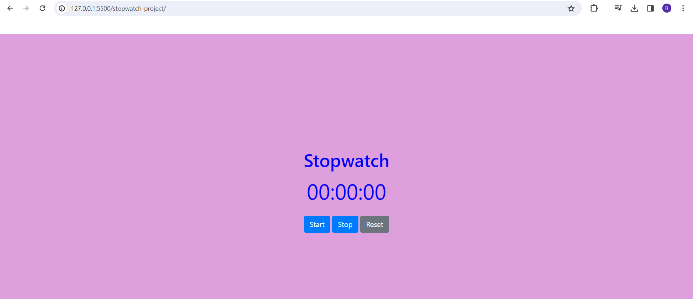

# stopwatch-app
This is a simple stopwatch project implemented in vanilla javascript. It provides basic stopwatch functionalities such as start, stop, and reset.

## Description

This is a simple stopwatch project implemented in vanilla javascript. It provides basic stopwatch functionalities such as start, stop, and reset.

## Features

- Start: Begin the stopwatch to measure elapsed time.
- Stop: Pause the stopwatch, allowing you to resume later.
- Reset: Set the stopwatch back to zero.

## Getting Started

### Prerequisites

- Need chrome browser or any browser to run html file.

### Installation

1. Clone the repository: `git clone https://github.com/yourusername/stopwatch-project.git`
2. Change directory: `cd stopwatch-project`
3. Run using any server or by opening index.html file in any browser.

## Usage

[Provide instructions on how to use the stopwatch. Include code snippets or command examples if applicable.]

```bash
# Example usage commands or code snippets
http://127.0.0.1:5500/stopwatch-project/


